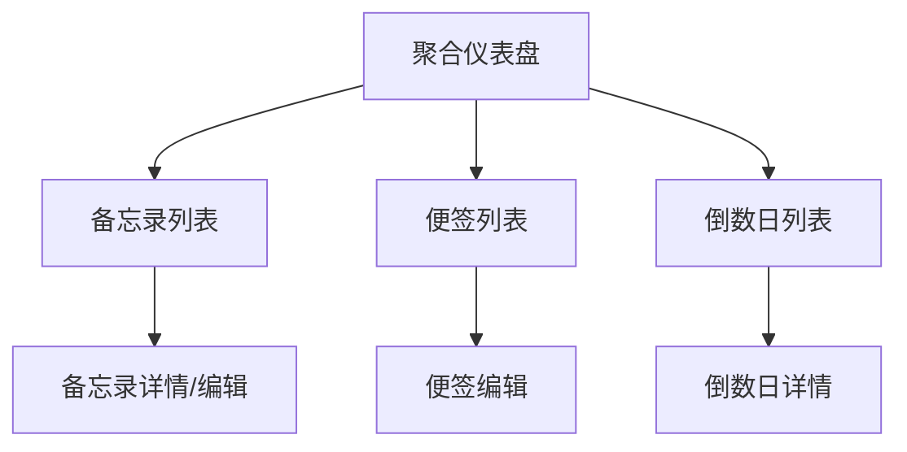

## 1. 产品概述
一款基于Android平台的个人事务管理应用，帮助用户高效管理日常备忘录、便签和倒数日事件。通过聚合仪表盘提供统一的数据展示界面，提升用户的工作和生活效率。

目标用户：需要管理个人事务、记录重要信息和追踪特殊日期的Android用户。

## 2. 核心功能

### 2.1 用户角色
| 角色 | 注册方式 | 核心权限 |
|------|----------|----------|
| 普通用户 | 本地使用，无需注册 | 完整使用所有功能，数据本地存储 |

### 2.2 功能模块
应用包含以下核心功能页面：
1. **聚合仪表盘**：数据概览、快速导航、今日事项展示
2. **备忘录列表**：备忘录管理、搜索筛选、分类标签
3. **便签列表**：便签创建、编辑、删除、颜色标记
4. **倒数日列表**：事件添加、倒计时显示、提醒设置

### 2.3 页面详情
| 页面名称 | 模块名称 | 功能描述 |
|----------|----------|----------|
| 聚合仪表盘 | 数据概览 | 显示备忘录、便签、倒数日数量统计，今日待办事项列表 |
| 聚合仪表盘 | 快速导航 | 提供进入各功能模块的快捷入口按钮 |
| 备忘录列表 | 备忘录管理 | 创建新备忘录、编辑现有备忘录、删除备忘录、标记完成状态 |
| 备忘录列表 | 搜索筛选 | 按标题关键词搜索、按分类标签筛选、按创建时间排序 |
| 便签列表 | 便签操作 | 新建便签、编辑便签内容、删除便签、设置便签颜色 |
| 便签列表 | 便签展示 | 网格/列表视图切换、便签预览、快速编辑模式 |
| 倒数日列表 | 事件管理 | 添加新事件、设置目标日期、编辑事件信息、删除事件 |
| 倒数日列表 | 倒计时显示 | 实时显示剩余天数、进度条展示、事件分类管理 |

## 3. 核心流程
用户打开应用后首先进入聚合仪表盘，可快速查看各类数据概览。通过底部导航栏或快捷按钮进入具体功能模块：

- 在备忘录模块中，用户可以创建、编辑、删除备忘录，并设置提醒时间
- 在便签模块中，用户可以快速记录临时信息，支持富文本编辑和颜色标记
- 在倒数日模块中，用户可以添加重要日期，应用会自动计算剩余天数并提供提醒

## 4. 用户界面设计

### 4.1 设计风格
- **主色调**：采用Microsoft Fluent Design风格，主色为系统蓝色(#0078D4)
- **辅助色**：浅灰色(#F3F2F1)、深灰色(#323130)、白色(#FFFFFF)
- **按钮样式**：圆角矩形设计，遵循Material Design规范
- **字体**：使用系统默认字体，标题18sp，正文14sp，小字12sp
- **布局风格**：卡片式布局，留白充足，层次分明
- **图标风格**：使用Outlined风格图标，线条简洁

### 4.2 页面设计概览
| 页面名称 | 模块名称 | UI元素 |
|----------|----------|----------|
| 聚合仪表盘 | 数据概览 | 顶部应用栏、统计卡片（备忘录/便签/倒数日数量）、今日事项列表（Material Design卡片） |
| 聚合仪表盘 | 快速导航 | 底部导航栏（备忘录/便签/倒数日/设置）、浮动操作按钮（FAB） |
| 备忘录列表 | 列表展示 | 顶部搜索栏、分类标签栏、备忘录列表项（标题、内容预览、创建时间、完成状态） |
| 备忘录列表 | 操作区域 | 底部添加按钮、长按多选模式、滑动删除手势 |
| 便签列表 | 网格展示 | 网格布局便签卡片、颜色标记、快速预览模式 |
| 便签列表 | 编辑模式 | 全屏编辑界面、工具栏（颜色选择/删除/保存）、富文本支持 |
| 倒数日列表 | 事件列表 | 事件卡片（事件名称、剩余天数、目标日期、进度条）、分类标签 |
| 倒数日列表 | 添加编辑 | 日期选择器、事件名称输入、提醒时间设置、分类选择 |

### 4.3 响应式设计
- **桌面端适配**：支持平板横屏模式，双列布局展示
- **移动端优化**：单手操作友好，重要按钮放置在屏幕下半部分
- **触摸交互**：支持长按、滑动、捏合等手势操作
- **无障碍支持**：支持TalkBack屏幕阅读器，字体大小适配系统设置

### 4.4 动画效果
- **页面切换**：使用共享元素过渡动画
- **列表项操作**：删除时的滑动动画，添加时的缩放动画
- **状态变化**：完成状态切换的淡入淡出效果
- **加载状态**：骨架屏加载动画，提升用户体验