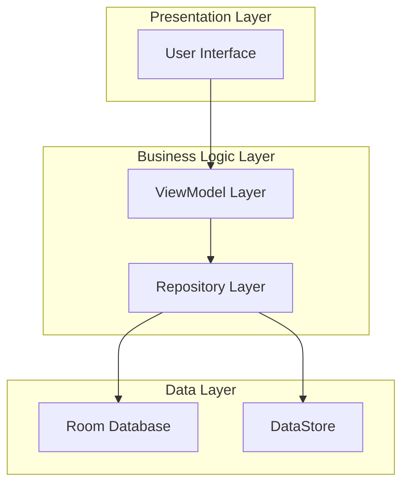
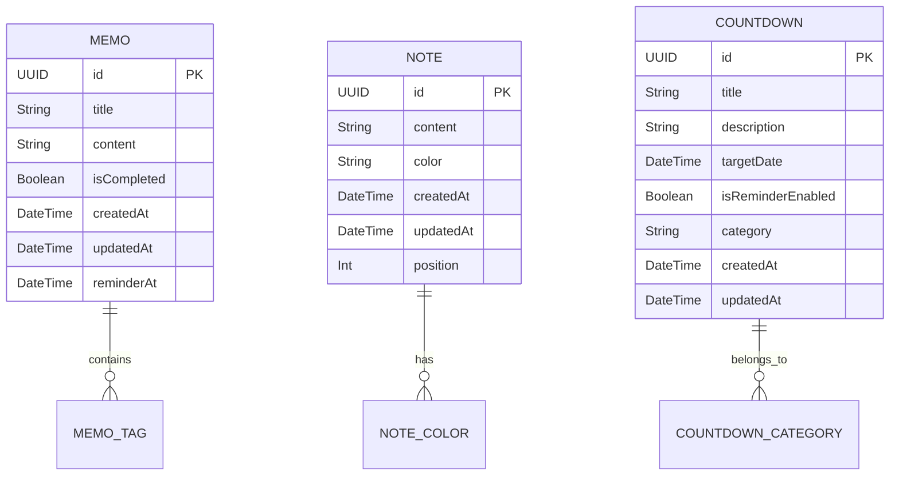

## 1. 架构设计



## 2. 技术描述

- **开发语言**: Kotlin 1.9+
- **UI框架**: Jetpack Compose 1.5+
- **架构模式**: MVVM (Model-View-ViewModel)
- **依赖注入**: Hilt 2.48+
- **本地数据库**: Room 2.6+
- **数据存储**: DataStore Preferences 1.0+
- **异步处理**: Kotlin Coroutines + Flow
- **构建工具**: Gradle Kotlin DSL 8.4+
- **最小SDK**: API 24 (Android 7.0)
- **目标SDK**: API 34 (Android 14)

## 3. 路由定义

| 路由 | 目的 |
|------|------|
| /dashboard | 聚合仪表盘，显示数据概览和快速导航 |
| /memos | 备忘录列表页面，管理所有备忘录 |
| /memo/{id} | 备忘录详情/编辑页面 |
| /notes | 便签列表页面，网格展示所有便签 |
| /note/{id} | 便签编辑页面 |
| /countdowns | 倒数日列表页面，显示所有倒计时事件 |
| /countdown/{id} | 倒数日详情/编辑页面 |
| /settings | 应用设置页面 |

## 4. 数据模型定义

### 4.1 数据库实体关系图



### 4.2 数据定义语言

备忘录表 (memos)
```kotlin
@Entity(tableName = "memos")
data class MemoEntity(
    @PrimaryKey
    val id: String = UUID.randomUUID().toString(),
    
    @ColumnInfo(name = "title")
    val title: String,
    
    @ColumnInfo(name = "content")
    val content: String,
    
    @ColumnInfo(name = "is_completed")
    val isCompleted: Boolean = false,
    
    @ColumnInfo(name = "created_at")
    val createdAt: Long = System.currentTimeMillis(),
    
    @ColumnInfo(name = "updated_at")
    val updatedAt: Long = System.currentTimeMillis(),
    
    @ColumnInfo(name = "reminder_at")
    val reminderAt: Long? = null
)
```

便签表 (notes)
```kotlin
@Entity(tableName = "notes")
data class NoteEntity(
    @PrimaryKey
    val id: String = UUID.randomUUID().toString(),
    
    @ColumnInfo(name = "content")
    val content: String,
    
    @ColumnInfo(name = "color")
    val color: String = "#FFFBBC00", // 默认黄色
    
    @ColumnInfo(name = "created_at")
    val createdAt: Long = System.currentTimeMillis(),
    
    @ColumnInfo(name = "updated_at")
    val updatedAt: Long = System.currentTimeMillis(),
    
    @ColumnInfo(name = "position")
    val position: Int = 0
)
```

倒数日表 (countdowns)
```kotlin
@Entity(tableName = "countdowns")
data class CountdownEntity(
    @PrimaryKey
    val id: String = UUID.randomUUID().toString(),
    
    @ColumnInfo(name = "title")
    val title: String,
    
    @ColumnInfo(name = "description")
    val description: String? = null,
    
    @ColumnInfo(name = "target_date")
    val targetDate: Long,
    
    @ColumnInfo(name = "is_reminder_enabled")
    val isReminderEnabled: Boolean = true,
    
    @ColumnInfo(name = "category")
    val category: String = "default",
    
    @ColumnInfo(name = "created_at")
    val createdAt: Long = System.currentTimeMillis(),
    
    @ColumnInfo(name = "updated_at")
    val updatedAt: Long = System.currentTimeMillis()
)
```

## 5. 项目目录结构

```
app/
├── src/main/java/com/example/memoapp/
│   ├── data/
│   │   ├── database/
│   │   │   ├── AppDatabase.kt
│   │   │   ├── dao/
│   │   │   │   ├── MemoDao.kt
│   │   │   │   ├── NoteDao.kt
│   │   │   │   └── CountdownDao.kt
│   │   │   └── entity/
│   │   │       ├── MemoEntity.kt
│   │   │       ├── NoteEntity.kt
│   │   │       └── CountdownEntity.kt
│   │   ├── repository/
│   │   │   ├── MemoRepository.kt
│   │   │   ├── NoteRepository.kt
│   │   │   └── CountdownRepository.kt
│   │   └── datastore/
│   │       └── PreferencesManager.kt
│   ├── domain/
│   │   ├── model/
│   │   │   ├── Memo.kt
│   │   │   ├── Note.kt
│   │   │   └── Countdown.kt
│   │   └── usecase/
│   │       ├── memo/
│   │       ├── note/
│   │       └── countdown/
│   ├── presentation/
│   │   ├── navigation/
│   │   │   └── AppNavigation.kt
│   │   ├── theme/
│   │   │   ├── Color.kt
│   │   │   ├── Theme.kt
│   │   │   └── Type.kt
│   │   ├── dashboard/
│   │   │   ├── DashboardScreen.kt
│   │   │   └── DashboardViewModel.kt
│   │   ├── memo/
│   │   │   ├── list/
│   │   │   └── detail/
│   │   ├── note/
│   │   │   ├── list/
│   │   │   └── detail/
│   │   └── countdown/
│   │       ├── list/
│   │       └── detail/
│   └── di/
│       └── AppModule.kt
├── src/main/res/
│   ├── drawable/
│   ├── values/
│   └── values-night/
└── build.gradle.kts
```

## 6. 关键依赖库

```kotlin
// 核心依赖
implementation("androidx.core:core-ktx:1.12.0")
implementation("androidx.lifecycle:lifecycle-runtime-ktx:2.7.0")
implementation("androidx.activity:activity-compose:1.8.2")

// Jetpack Compose
implementation(platform("androidx.compose:compose-bom:2024.02.00"))
implementation("androidx.compose.ui:ui")
implementation("androidx.compose.ui:ui-graphics")
implementation("androidx.compose.ui:ui-tooling-preview")
implementation("androidx.compose.material3:material3")
implementation("androidx.navigation:navigation-compose:2.7.7")

// Room数据库
implementation("androidx.room:room-runtime:2.6.1")
implementation("androidx.room:room-ktx:2.6.1")
ksp("androidx.room:room-compiler:2.6.1")

// Hilt依赖注入
implementation("com.google.dagger:hilt-android:2.48")
ksp("com.google.dagger:hilt-compiler:2.48")
implementation("androidx.hilt:hilt-navigation-compose:1.1.0")

// Coroutines和Flow
implementation("org.jetbrains.kotlinx:kotlinx-coroutines-android:1.7.3")
implementation("androidx.lifecycle:lifecycle-viewmodel-ktx:2.7.0")

// DataStore
implementation("androidx.datastore:datastore-preferences:1.0.0")

// 日期时间处理
implementation("org.jetbrains.kotlinx:kotlinx-datetime:0.5.0")

// 测试依赖
testImplementation("junit:junit:4.13.2")
androidTestImplementation("androidx.test.ext:junit:1.1.5")
androidTestImplementation("androidx.test.espresso:espresso-core:3.5.1")
androidTestImplementation(platform("androidx.compose:compose-bom:2024.02.00"))
androidTestImplementation("androidx.compose.ui:ui-test-junit4")
debugImplementation("androidx.compose.ui:ui-tooling")
debugImplementation("androidx.compose.ui:ui-test-manifest")
```

## 7. 构建配置

```kotlin
// build.gradle.kts (项目级)
plugins {
    id("com.android.application") version "8.2.2" apply false
    id("org.jetbrains.kotlin.android") version "1.9.22" apply false
    id("com.google.dagger.hilt.android") version "2.48" apply false
    id("com.google.devtools.ksp") version "1.9.22-1.0.17" apply false
}

// app/build.gradle.kts (应用级)
android {
    namespace = "com.example.memoapp"
    compileSdk = 34

    defaultConfig {
        applicationId = "com.example.memoapp"
        minSdk = 24
        targetSdk = 34
        versionCode = 1
        versionName = "1.0"
    }

    buildFeatures {
        compose = true
    }
    
    composeOptions {
        kotlinCompilerExtensionVersion = "1.5.8"
    }
}
```