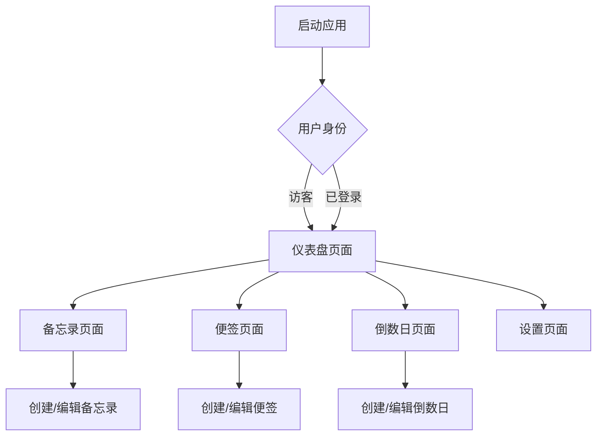

## 1. 产品概述
微软风格聚合软件是一款集备忘录、便签、倒数日功能于一体的效率工具。采用微软Fluent Design设计语言，为用户提供熟悉且现代化的界面体验。
- 解决用户多应用切换的效率问题，提供一站式信息管理解决方案
- 面向需要高效管理日常事务的个人用户和办公场景
- 通过整合常用功能，提升用户工作效率和生活便利性

## 2. 核心功能

### 2.1 用户角色
| 角色 | 注册方式 | 核心权限 |
|------|----------|----------|
| 普通用户 | 邮箱注册 | 创建、编辑、删除所有内容 |
| 访客用户 | 无需注册 | 浏览基础功能，数据本地存储 |

### 2.2 功能模块
聚合软件包含以下主要页面：
1. **仪表盘页面**：功能概览、快速访问、数据统计
2. **备忘录页面**：备忘录列表、创建编辑、分类管理
3. **便签页面**：便签墙、快速创建、颜色标记
4. **倒数日页面**：事件列表、倒数显示、提醒设置
5. **设置页面**：主题切换、数据导出、账户管理

### 2.3 页面详情
| 页面名称 | 模块名称 | 功能描述 |
|----------|----------|----------|
| 仪表盘页面 | 功能概览 | 显示备忘录、便签、倒数日数量统计 |
| 仪表盘页面 | 快速访问 | 展示最近使用的功能和快捷操作 |
| 仪表盘页面 | 数据可视化 | 图表显示使用频率和完成情况 |
| 备忘录页面 | 备忘录列表 | 按时间排序显示所有备忘录 |
| 备忘录页面 | 创建编辑 | 支持富文本编辑、标题、内容、标签 |
| 备忘录页面 | 分类管理 | 创建文件夹、拖拽分类、搜索筛选 |
| 便签页面 | 便签墙 | 网格布局显示所有便签 |
| 便签页面 | 快速创建 | 点击空白处快速新建便签 |
| 便签页面 | 颜色标记 | 8种预设颜色、自定义颜色选择 |
| 倒数日页面 | 事件列表 | 卡片式显示所有倒数事件 |
| 倒数日页面 | 倒数显示 | 实时更新剩余天数、小时、分钟 |
| 倒数日页面 | 提醒设置 | 设置提醒时间、重复周期 |
| 设置页面 | 主题切换 | 浅色/深色主题、跟随系统 |
| 设置页面 | 数据导出 | 导出为PDF、Markdown格式 |
| 设置页面 | 账户管理 | 个人信息、密码修改、注销 |

## 3. 核心流程
用户首次使用流程：
1. 访客用户可直接使用基础功能，数据本地存储
2. 注册用户可通过邮箱创建账户，数据云端同步
3. 登录后进入仪表盘，可快速访问各功能模块
4. 在各功能模块中创建、编辑、管理内容
5. 设置页面可个性化配置和数据管理

## 4. 用户界面设计

### 4.1 设计风格
- **主色调**：微软蓝色 (#0078D4)、浅灰色 (#F3F2F1)
- **按钮样式**：圆角矩形、Fluent Design亚克力效果
- **字体**：Segoe UI，标题20px，正文14px
- **布局风格**：卡片式布局、左侧导航栏、响应式网格
- **图标风格**：微软Fluent图标库，线条简洁

### 4.2 页面设计概览
| 页面名称 | 模块名称 | UI元素 |
|----------|----------|--------|
| 仪表盘页面 | 功能概览 | 统计卡片采用亚克力材质，数字大字体显示 |
| 仪表盘页面 | 快速访问 | 圆形图标按钮，悬停有缩放动画 |
| 备忘录页面 | 备忘录列表 | 列表项左侧图标，右侧时间戳，悬停背景变化 |
| 便签页面 | 便签墙 | 便签卡片有阴影效果，拖拽时有透明度变化 |
| 倒数日页面 | 事件列表 | 卡片显示剩余时间，进度条显示完成度 |

### 4.3 响应式设计
- 桌面端优先设计，支持1920x1080、1366x768等常见分辨率
- 平板端自适应，导航栏转换为汉堡菜单
- 移动端优化，触摸交互友好，支持手势操作

### 4.4 动画效果
- 页面切换使用Fluent Design的连贯动画
- 按钮点击有涟漪效果
- 卡片悬停有轻微上浮和阴影加深
- 数据加载使用骨架屏和渐进式显示