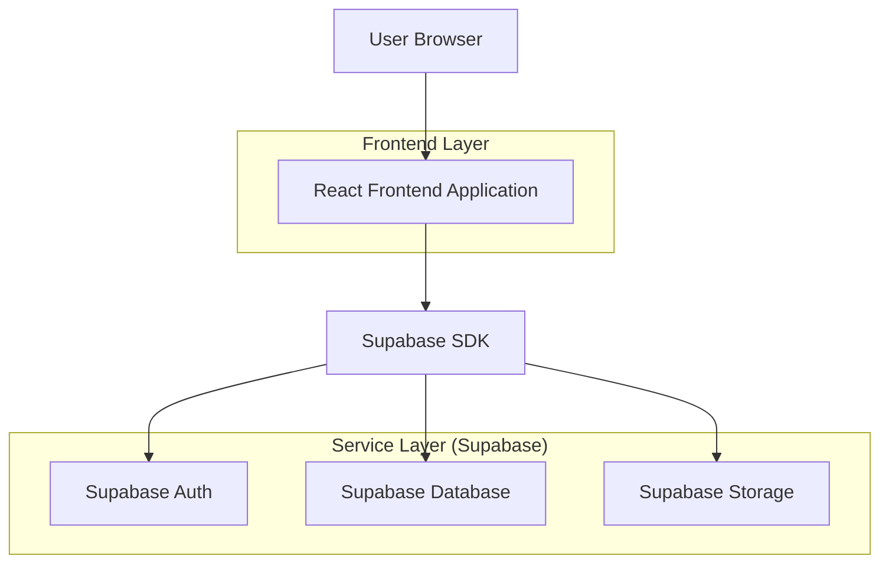
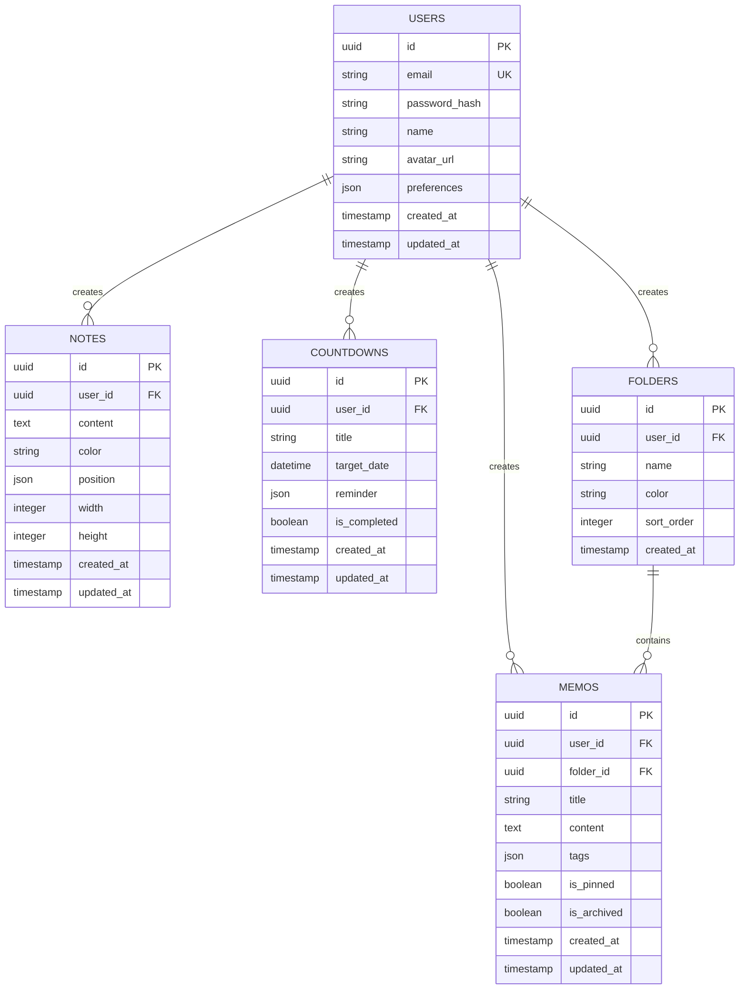

## 1. 架构设计



## 2. 技术描述

- **前端**: React@18 + TypeScript + Tailwind CSS + Fluent UI React
- **初始化工具**: vite-init
- **后端**: Supabase (BaaS)
- **状态管理**: React Context + useReducer
- **UI组件库**: @fluentui/react-components
- **图标库**: @fluentui/react-icons
- **富文本编辑器**: @monaco-editor/react
- **日期处理**: date-fns
- **拖拽功能**: react-beautiful-dnd

## 3. 路由定义

| 路由 | 用途 |
|-------|---------|
| / | 仪表盘页面，应用主入口 |
| /memos | 备忘录页面，管理所有备忘录 |
| /notes | 便签页面，便签墙展示 |
| /countdown | 倒数日页面，管理倒数事件 |
| /settings | 设置页面，个性化配置 |
| /login | 登录页面，用户认证 |
| /register | 注册页面，新用户注册 |

## 4. API定义

### 4.1 认证API

用户登录
```
POST /api/auth/login
```

请求参数:
| 参数名 | 参数类型 | 是否必需 | 描述 |
|-----------|-------------|-------------|-------------|
| email | string | true | 用户邮箱 |
| password | string | true | 密码 |

响应:
| 参数名 | 参数类型 | 描述 |
|-----------|-------------|-------------|
| user | object | 用户信息 |
| session | object | 会话token |

### 4.2 备忘录API

获取备忘录列表
```
GET /api/memos
```

创建备忘录
```
POST /api/memos
```

请求体:
| 参数名 | 参数类型 | 是否必需 | 描述 |
|-----------|-------------|-------------|-------------|
| title | string | true | 备忘录标题 |
| content | string | true | 备忘录内容 |
| folder_id | string | false | 文件夹ID |
| tags | array | false | 标签数组 |

### 4.3 便签API

获取便签列表
```
GET /api/notes
```

创建便签
```
POST /api/notes
```

请求体:
| 参数名 | 参数类型 | 是否必需 | 描述 |
|-----------|-------------|-------------|-------------|
| content | string | true | 便签内容 |
| color | string | true | 颜色代码 |
| position | object | false | 位置信息 |

### 4.4 倒数日API

获取倒数事件
```
GET /api/countdowns
```

创建倒数事件
```
POST /api/countdowns
```

请求体:
| 参数名 | 参数类型 | 是否必需 | 描述 |
|-----------|-------------|-------------|-------------|
| title | string | true | 事件标题 |
| target_date | string | true | 目标日期 |
| reminder | object | false | 提醒设置 |

## 5. 数据模型

### 5.1 数据模型定义



### 5.2 数据定义语言

用户表 (users)
```sql
-- 创建表
CREATE TABLE users (
    id UUID PRIMARY KEY DEFAULT gen_random_uuid(),
    email VARCHAR(255) UNIQUE NOT NULL,
    password_hash VARCHAR(255) NOT NULL,
    name VARCHAR(100) NOT NULL,
    avatar_url TEXT,
    preferences JSONB DEFAULT '{}',
    created_at TIMESTAMP WITH TIME ZONE DEFAULT NOW(),
    updated_at TIMESTAMP WITH TIME ZONE DEFAULT NOW()
);

-- 创建索引
CREATE INDEX idx_users_email ON users(email);
```

备忘录表 (memos)
```sql
-- 创建表
CREATE TABLE memos (
    id UUID PRIMARY KEY DEFAULT gen_random_uuid(),
    user_id UUID NOT NULL REFERENCES users(id) ON DELETE CASCADE,
    folder_id UUID REFERENCES folders(id) ON DELETE SET NULL,
    title VARCHAR(255) NOT NULL,
    content TEXT NOT NULL,
    tags JSONB DEFAULT '[]',
    is_pinned BOOLEAN DEFAULT false,
    is_archived BOOLEAN DEFAULT false,
    created_at TIMESTAMP WITH TIME ZONE DEFAULT NOW(),
    updated_at TIMESTAMP WITH TIME ZONE DEFAULT NOW()
);

-- 创建索引
CREATE INDEX idx_memos_user_id ON memos(user_id);
CREATE INDEX idx_memos_folder_id ON memos(folder_id);
CREATE INDEX idx_memos_created_at ON memos(created_at DESC);
```

便签表 (notes)
```sql
-- 创建表
CREATE TABLE notes (
    id UUID PRIMARY KEY DEFAULT gen_random_uuid(),
    user_id UUID NOT NULL REFERENCES users(id) ON DELETE CASCADE,
    content TEXT NOT NULL,
    color VARCHAR(7) DEFAULT '#FFF59D',
    position JSONB DEFAULT '{"x": 0, "y": 0}',
    width INTEGER DEFAULT 200,
    height INTEGER DEFAULT 150,
    created_at TIMESTAMP WITH TIME ZONE DEFAULT NOW(),
    updated_at TIMESTAMP WITH TIME ZONE DEFAULT NOW()
);

-- 创建索引
CREATE INDEX idx_notes_user_id ON notes(user_id);
```

倒数日表 (countdowns)
```sql
-- 创建表
CREATE TABLE countdowns (
    id UUID PRIMARY KEY DEFAULT gen_random_uuid(),
    user_id UUID NOT NULL REFERENCES users(id) ON DELETE CASCADE,
    title VARCHAR(255) NOT NULL,
    target_date TIMESTAMP WITH TIME ZONE NOT NULL,
    reminder JSONB DEFAULT '{"enabled": false, "time": "09:00"}',
    is_completed BOOLEAN DEFAULT false,
    created_at TIMESTAMP WITH TIME ZONE DEFAULT NOW(),
    updated_at TIMESTAMP WITH TIME ZONE DEFAULT NOW()
);

-- 创建索引
CREATE INDEX idx_countdowns_user_id ON countdowns(user_id);
CREATE INDEX idx_countdowns_target_date ON countdowns(target_date);
```

文件夹表 (folders)
```sql
-- 创建表
CREATE TABLE folders (
    id UUID PRIMARY KEY DEFAULT gen_random_uuid(),
    user_id UUID NOT NULL REFERENCES users(id) ON DELETE CASCADE,
    name VARCHAR(100) NOT NULL,
    color VARCHAR(7) DEFAULT '#0078D4',
    sort_order INTEGER DEFAULT 0,
    created_at TIMESTAMP WITH TIME ZONE DEFAULT NOW()
);

-- 创建索引
CREATE INDEX idx_folders_user_id ON folders(user_id);
```

### 5.3 Supabase访问权限

```sql
-- 基本访问权限
GRANT SELECT ON users TO anon;
GRANT SELECT ON memos TO anon;
GRANT SELECT ON notes TO anon;
GRANT SELECT ON countdowns TO anon;
GRANT SELECT ON folders TO anon;

-- 认证用户完整权限
GRANT ALL PRIVILEGES ON users TO authenticated;
GRANT ALL PRIVILEGES ON memos TO authenticated;
GRANT ALL PRIVILEGES ON notes TO authenticated;
GRANT ALL PRIVILEGES ON countdowns TO authenticated;
GRANT ALL PRIVILEGES ON folders TO authenticated;

-- RLS策略示例（备忘录）
ALTER TABLE memos ENABLE ROW LEVEL SECURITY;

CREATE POLICY "用户只能查看自己的备忘录" ON memos
    FOR SELECT USING (auth.uid() = user_id);

CREATE POLICY "用户只能创建自己的备忘录" ON memos
    FOR INSERT WITH CHECK (auth.uid() = user_id);

CREATE POLICY "用户只能更新自己的备忘录" ON memos
    FOR UPDATE USING (auth.uid() = user_id);

CREATE POLICY "用户只能删除自己的备忘录" ON memos
    FOR DELETE USING (auth.uid() = user_id);
```